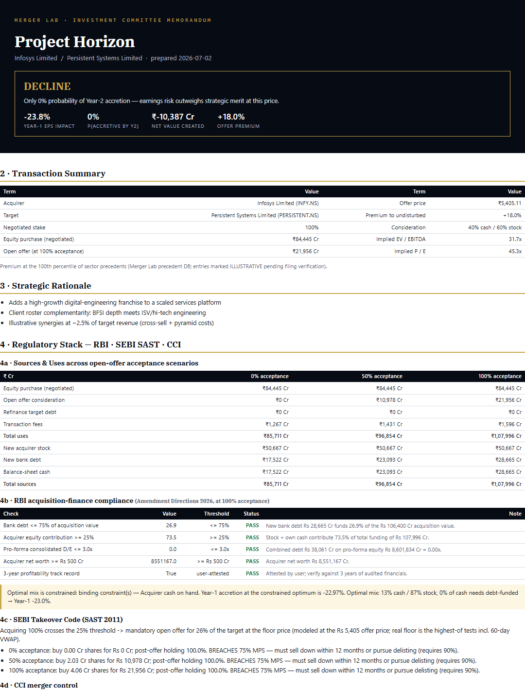

# MERGER LAB

**An M&A accretion/dilution engine for Indian public markets — build the model, ship the IC memo.**



## Why now

RBI's acquisition-finance liberalization (amended 13 Feb 2026, effective 1 Apr 2026) allows Indian
banks to finance corporate acquisitions for the first time: up to **75% of acquisition value** in
bank debt, minimum **25% acquirer equity**, maximum **3:1 consolidated debt-to-equity**, acquirer
net worth ≥ ₹500 crore with a 3-year profitability track record. That opens a structural
M&A/consolidation wave in India — and every deal in that wave needs exactly the analysis this
engine produces.

## What it produces

1. **An IC memo PDF** — pyramid-principle, recommendation first, with a regulatory-stack section
   (RBI financing compliance, SEBI SAST open-offer scenarios, MPS/CCI flags) no generic template has.
2. **A linked Excel model** — every tab downstream of Assumptions is live cross-referenced formulas;
   a Δ-vs-engine column proves the workbook ties to the Python engine to the last decimal.
3. A Streamlit deal room (secondary — the dashboard is a wrapper, the memo and Excel are the product).

Three pre-run sample deal rooms live in [`samples/`](samples) — including an honest **DECLINE**:
when a 24x-earnings acquirer buys a 60x-earnings target, the engine says so.

| Sample | Structure | Verdict |
|---|---|---|
| Project Horizon (IT) | 100% acquisition, 60% stock, collar priced | DECLINE — mechanical dilution |
| Project Bastion (Cement) | 64% promoter block + 26% open offer | DECLINE — premium unsupported |
| Project Meridian (Metals) | 51% + open offer, 100% cash in RBI guardrails | PROCEED WITH CONDITIONS |

## Module map

| Module | What it does |
|---|---|
| `src/data_layer.py` | yfinance + Screener.in CSV fallback, INR-crore normalization, 24h cache, USD-filer FX inference |
| `src/precedent_db.py` | SQLite precedent DB, 37 India deals 2019–2025; window-function premium percentiles, CTE comps — raw SQL on purpose |
| `src/sources_uses.py` · `deal.py` · `ppa.py` | S&U balanced to the rupee (asserted), PPA with DTL and goodwill |
| `src/rbi_compliance.py` | The five RBI 2026 guardrail checks, PASS/FAIL with explanations |
| `src/sebi_sast.py` | 25% trigger → 26% open offer, acceptance scenarios, MPS breach, creeping acquisition, CCI threshold |
| `src/accretion_dilution.py` | Y1–3 pro-forma EPS engine, analytic break-even synergies, earnings-yield heuristic cross-check |
| `src/contribution.py` · `sensitivity.py` | Contribution vs ownership exhibit; two-way grids that re-run the full engine per cell |
| `src/optimizer.py` | SLSQP financing-mix optimizer against the real engine, binding RBI constraint named in the memo |
| `src/monte_carlo.py` | 10,000 seeded iterations; P(accretive by Y2), P5/P50/P95 |
| `src/value_bridge.py` | Synergy PV vs control premium, ROIC vs WACC, "accretive but value-destructive" warning |
| `src/collar.py` · `merger_arb.py` | Black-Scholes exchange-ratio collar (long put / short call), market-implied close probability |
| `src/memo_generator.py` · `excel_generator.py` | The deliverables: Jinja2→PDF memo with inline-SVG charts, 10-tab formula-linked workbook |

## Data sources — zero paid APIs

yfinance (prices, financials, shares), manual Screener.in CSV exports (fundamentals fallback),
curated precedent transactions from SEBI SAST letters of offer and NSE/BSE filings. Debt cost
anchored to RBI DBIE lending-rate publications; risk-free = 10Y G-Sec (CCIL/FIMMDA). No paid APIs,
no scraping, no LLM calls anywhere in the pipeline.

## Methodology notes

- Combined NI = acquirer NI + owned% × target NI + after-tax phased synergies − after-tax new
  interest − after-tax foregone cash yield − after-tax incremental D&A − after-tax Y1 integration costs.
- Break-even synergies solved analytically (the equation is linear).
- Every module carries a `methodology` docstring; every simplification is documented where it lives.
- `tests/test_known_deal.py` is the credibility anchor: a toy deal with every expected value derived
  by hand in the comments, asserted to 0.1%. 28 tests total.

## How to run

```bash
pip install -r requirements.txt
python tests/test_known_deal.py        # the sacred hand-checked suite
python generate_samples.py             # rebuild the sample deal rooms (live yfinance data)
streamlit run app/streamlit_app.py     # the deal room
```

The landing page in [`site/`](site) is a single static file — deploy with `vercel site/`
(set the Streamlit URL in `index.html` first).

## Limitations & disclaimers

Illustrative analysis on public data for portfolio demonstration — **not investment advice**.
Sample transactions are hypothetical. Precedent-DB rows marked `ILLUSTRATIVE — verify` carry
unverified numbers pending checks against the cited filings. Standalone EPS held flat Y1–3;
partial stakes consolidated economically (no minority-interest line); SAST floor price modeled
at the deal offer price (real floor is the highest-of tests incl. 60-day VWAP). Verify RBI/SEBI
parameters against the master directions before relying on any output.

## Roadmap

- Verify precedent seed rows against letters of offer (replace ILLUSTRATIVE tags)
- Regulatory WACC helper (CAPM with India ERP input) and target-price DCF cross-check
- Deal-financing term sheet exhibit (tenor/amortization schedule vs RBI ongoing D/E test)
- Hindi-language memo variant

---
*MERGER LAB · DogInfantry · repo: M&A accretion/dilution engine for India — IC memo + Excel model
outputs. RBI 2026 acquisition-finance framework built in.*
